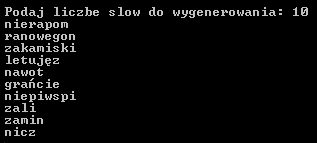

# Generator of new Polish words

## General info

This project was made for my classes. It is written in C++ and contains 350 lines of code. The software is designed to create new words, which are familliar to existing ones. It is processing polish dictionary to make probability array, which contains probability of occurrence of the next letter based on two previous. Then the software randomly generate new words of the desired length. Project was made to create new words that can be used, for example, like a password. It is a good idea, because such words are easier to remember.

## Technologies

Project is created with:
* C++ version: 17

## Setup
To run the simulation, compile main.cpp. Script needs input.txt file, which is polish dictionary. Software needs to make probability file from it or it just can run, if it is already made.

